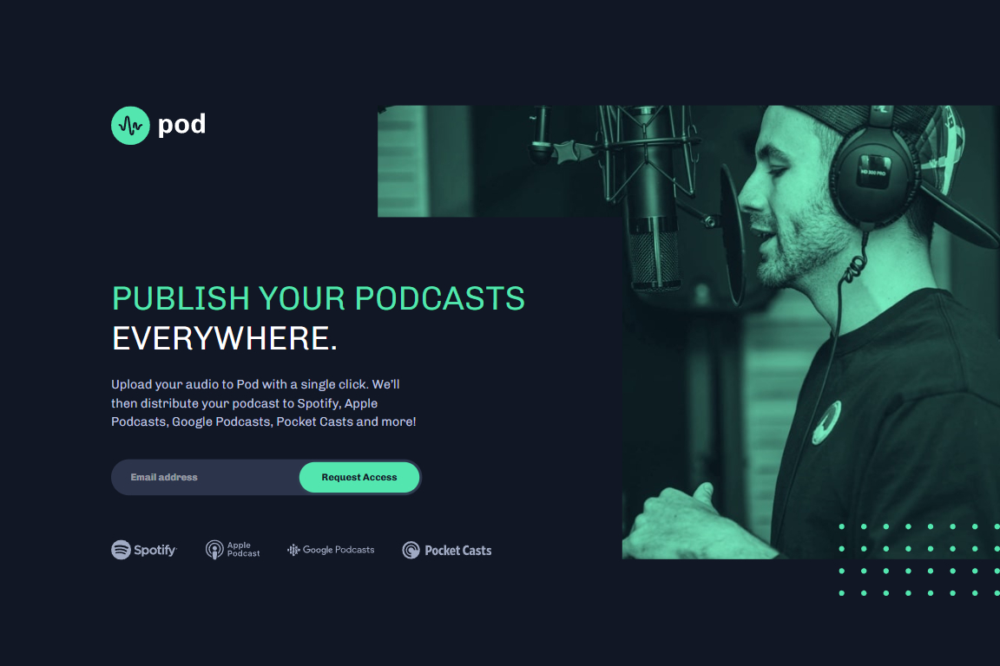

# Frontend Mentor - Pod request access landing page solution

This is a solution to the [Pod request access landing page challenge on Frontend Mentor](https://www.frontendmentor.io/challenges/pod-request-access-landing-page-eyTmdkLSG). Frontend Mentor challenges help you improve your coding skills by building realistic projects. 

## Table of contents

- [Overview](#overview)
  - [The challenge](#the-challenge)
  - [Screenshot](#screenshot)
  - [Links](#links)
- [My process](#my-process)
  - [Built with](#built-with)
  - [Continued development](#continued-development)
  - [Useful resources](#useful-resources)
- [Author](#author)
  - [Connect with Me](#Connect-with-Me)
  - [Coding Profiles](#Coding-Profiles)

## Overview

### The challenge

Users should be able to:

- View the optimal layout depending on their device's screen size
- See hover states for interactive elements
- Receive an error message when the form is submitted if:
  - The `Email address` field is empty should show "Oops! Please add your email"
  - The email is not formatted correctly should show "Oops! Please check your email"

### Screenshot

### Links

- [Solution URL](https://github.com/DalaScript/pod-request-access-landing-page)
- [Live Site URL](https://dalascript.github.io/pod-request-access-landing-page/)

## My process

### Built with

- Semantic HTML5 markup
- CSS custom properties
- Flexbox
- Mobile-first workflow
- JavaScript
- bem - [Block Element Modifier](https://getbem.com/introduction/)
- scss - [Sassy Cascading Style Sheets](https://sass-lang.com/documentation/at-rules/control/for/)

### What I learned

Nothing special, this project was very easy for me

### Continued development

am currently focused on advancing my skills in both frontend and backend development. On the frontend side, I am exploring modern frameworks and libraries such as React, Svelte, Tailwind CSS, and Ant Design to build responsive and dynamic user interfaces.

For backend development, I am working with technologies including Express.js, Next.js, Prisma, MySQL, and TypeScript to gain a deeper understanding of server-side logic, APIs, and database management.

My goal is to become a well-rounded developer by continuously learning and applying these tools in real-world projects.

### Useful resources

- [ChatGPT](https://chatgpt.com/) - He is my hero, if I need something fast, if I can't understand something, or if I can't find it on the internet, I always ask him.
- [W3Schools](https://www.w3schools.com/) - This is my favorite documentation platform I've been using since I started programming, it's the best explained resource.
- [MDN](https://developer.mozilla.org/en-US/) - This is also my favorite documentation platform, which I've been using a lot lately.
- [YouTube](https://www.youtube.com/) - I'm always looking for news and listening to other developers, sharing their experiences so that I can see many different solutions to a problem.

## Author

### Connect with Me

- [Instagram](https://www.instagram.com/DalaScript)
- [YouTube](https://www.youtube.com/@DalaScript)

### Coding Profiles

- [freeCodeCamp](https://www.freecodecamp.org/DalaScript)
- [FrontendMentor](https://www.frontendmentor.io/profile/DalaScript)
- [GitHub](https://github.com/DalaScript)